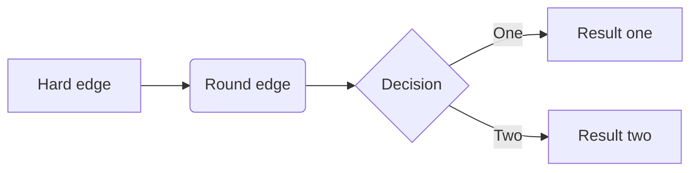
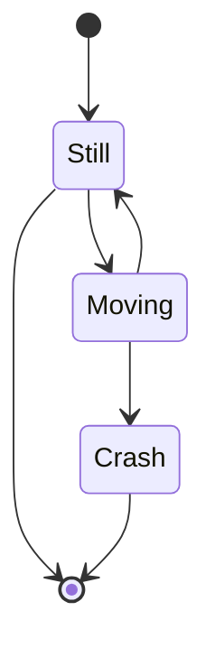
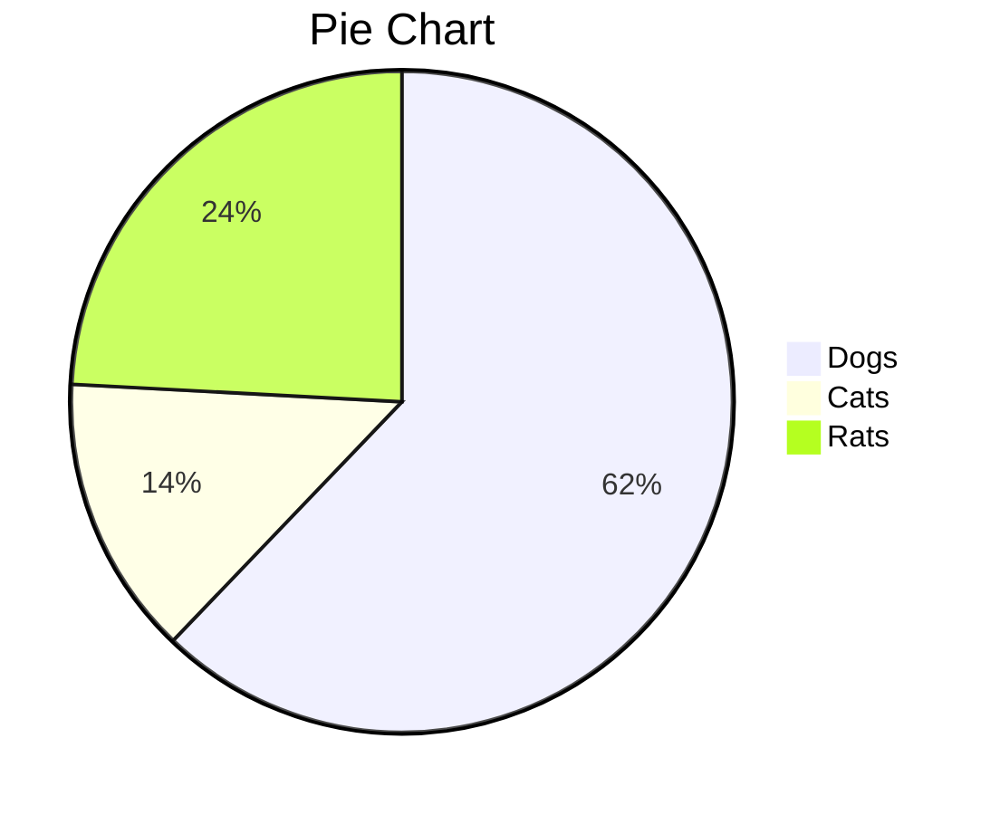

AAAAAAAAAAAAAAAAAAAAAAAAAAAAAAAAAAAAAAAAAAAAAAAAAAAAAAAAAAAAAAAAAAAAAAAA
BBBBBBBBBBBBBBBBBBBBBBBBBBBBBBBBBBBBBBBBBBBBBBBBBBBBBBBBBBBBBBBBBBBBBBBBBBBBBB

|제목|내용|설명|
|---|---|---|
|테스트1|*강조1*|테스트3|
|테스트1|**강조2**|테스트3|
|테스트1|<span style="color:red">강조3</span>|테스트3|


[](https://youtu.be/SgEHWxZsLzo?t=0s)

<div class="mermaid" markdown="0" >
    graph TD 
    A[Client] -->|tcp_123| B(Load Balancer) 
    B -->|tcp_456| C[Server1] 
    B -->|tcp_456| D[Server2]
</div>



<script src="./flowchart.js"></script>

```flow
st=>start: Start
op=>operation: Your Operation
cond=>condition: Yes or No?
e=>end
st->op->cond
cond(yes)->e
cond(no)->op
```






